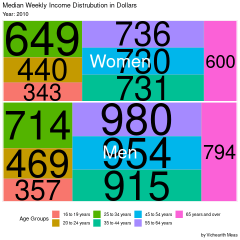

```{r setup, include=FALSE}
knitr::opts_chunk$set(echo = TRUE, 
                      error=TRUE, 
                      message=FALSE, 
                      warning=FALSE)
```


```{r libraries}
library(tidyverse)     # for graphing and data cleaning
library(lubridate)     # for date manipulation
library(ggthemes)      # for even more plotting themes
#library(janitor)       # for cleaning variable names
theme_set(theme_minimal()) # My favorite ggplot() theme :)
library(treemapify)
```

```{r}
# Read in the data for the week
employed <- readr::read_csv('https://raw.githubusercontent.com/rfordatascience/tidytuesday/master/data/2021/2021-02-23/employed.csv')

earn <- readr::read_csv('https://raw.githubusercontent.com/rfordatascience/tidytuesday/master/data/2021/2021-02-23/earn.csv')


```
In this week, I am interested in comparing the __median weekly income__ of men and women in the last decade from 2010 to 2020. I decide to use `geom_treemap` and `gganimate` to create animation of a treemap that display the proportion of average median weekly income for each year and each ages group. 
```{r}
earn_clean <-  earn %>% 
  filter(sex !="Both Sexes", age %in% c("16 to 19 years", "20 to 24 years", "25 to 34 years", "35 to 44 years", "45 to 54 years","55 to 64 years", "65 years and over")) %>% 
  group_by(sex, age, year) %>% 
  summarise(avg_median_weekly_earn = ceiling(sum(median_weekly_earn)/4), label = paste( avg_median_weekly_earn ))
earn_clean
```


```{r eval=FALSE}
p <-
  earn_clean %>% 
  ggplot(aes(
    label = label,
    area = avg_median_weekly_earn,
    subgroup = sex,
    fill = age
  )) +
  geom_treemap(layout = "fixed") +
  geom_treemap_text(layout = "fixed", place = "centre", grow = TRUE ) +
  geom_treemap_subgroup_text(layout = "fixed", place = "centre", color = "white") +
  geom_treemap_subgroup_border(layout = "fixed", color="white")+
  theme(legend.position = "bottom")+
  transition_time(year) +
  ease_aes('linear') +
  labs(title = "Median Weekly Income Distrubution in Dollars", subtitle = "Year: {round(frame_time,0)}", caption = " by Vichearith Meas", fill="Age Groups")
#
```


```{r eval=FALSE}
animate(p, duration = 1, fps = 15)
```


```{r eval=FALSE}
anim_save("tidyTuesday5_treemap.gif")
```

```{r}

```


